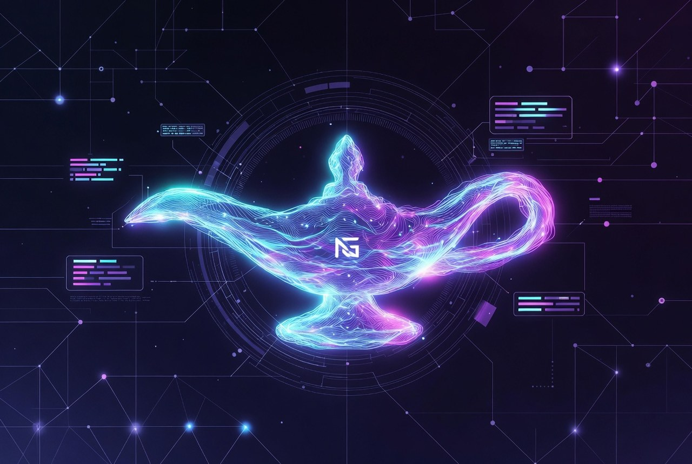

<div align="center">

# Neon Genie

### Governed opportunity & product intelligence for Hermes

[](./manifest.json)
[](./.github/workflows/hermes-evals.yml)
[](#authority--safety)
[](./LICENSE)



**Turn weak signals and blocked transitions into evidence-bound, testable product and opportunity packets — without inventing facts or granting spend/execute rights.**

[How to use](#how-to-use) · [Install](#installation) · [Commands](#command-cheat-sheet) · [Demo](./docs/DEMO.md) · [Premiere](./docs/PREMIERE.md)

</div>

---

## What it is

Neon Genie is a **Hermes skill** (this repo root is the skill). It helps you:

- audit product coherence and draft Wayfinder-ready handoffs  
- mine opportunities and zero-capital first-cash loops  
- map fragmentation, commercial models, agentic graphs, evidence gaps  
- **fail closed** when proof, buyer, or access is missing  

It is **not** Kubrick (cinematic), **not** Wayfinder (engineering execution), and **not** a free-form idea generator.

| Principle | In practice |
|-----------|-------------|
| Evidence-bound | Claims are `OBSERVED` · `INFERRED` · `SPECULATIVE` · `NOT_COMPUTABLE` |
| Find or request | Public facts → research. Private facts → `DataRequest`. Never invent. |
| Advisory only | May draft and recommend. May **not** spend, publish, contact, or mutate repos. |
| Smallest profiles | Loads only the contracts the job needs (`core` always). |

---

## How to use

### Three-minute path

```bash
./install.sh                                          # or hermes skills install …
python scripts/neon_genie.py do doctor                # smoke
python scripts/neon_genie.py do run --recipe product-audit --out out/neon-genie/demo
# open out/neon-genie/demo/run-envelope.json first
```

### Talk to Hermes (judgment)

Install → invoke Neon Genie → describe who is stuck and what “done” looks like.  
Hermes follows **OPEN → ALIGN → ASCEND → CLEAR → SEAL**. Outputs are drafts only.

```text
/neon-genie We have an audio continuity tool but no defined buyer.
What should we charge? Research public comps; request private buyer data;
do not invent; do not modify the repo.
```

Prompts: [QUICKSTART.md](./QUICKSTART.md) · Prose goldens: [evals/transcripts/](./evals/transcripts/) · Behavioral: [evals/behavioral/](./evals/behavioral/)

### Command line (packaging — not a product brain)

```text
python scripts/neon_genie.py do <job> [options]
```

| Job | Use |
|-----|-----|
| `doctor` | Full smoke |
| `run` | **Operator path** — brief/recipe → workspace + `run-envelope.json` |
| `capabilities` | Machine-readable surface (`--json`) for orchestrators |
| `recipe` / `route` / `validate` | Examples, profile routing, schema check |
| `receipt` / `envelope` | Receipt + canonical envelope |
| `eval` / `transcripts` / `behavioral` | Gates and semantic suites |
| `learn` / `reconcile` | PROPOSED ledger + run_id linkage (never auto-canon) |

```bash
python scripts/neon_genie.py help
python scripts/neon_genie.py do run --brief examples/product-audit.brief.yaml --out out/neon-genie/demo
python scripts/neon_genie.py do capabilities --json
```

---

## Worked example (before → after)

**Input**

> “We have an audio continuity tool but no defined buyer.”

**What Neon Genie does**

| Step | Result |
|------|--------|
| OPEN | Product category known; buyer missing |
| ALIGN | Public research allowed; **DataRequest** for private buyer/budget authority |
| ASCEND | Claims labeled; firm price is `NOT_COMPUTABLE` without buyer |
| CLEAR | Gate Q (private gap) blocks promotion past CONCEPTUAL |
| SEAL | Packets + receipt + **`run-envelope.json`** — still `advisory_only` |

**You should see**

- Product boundary clarified (draft)  
- Buyer marked **NOT_COMPUTABLE** until evidence  
- Open `DataRequest` (blocks promotion)  
- Testable diagnostic offer only after roles exist  
- Wayfinder handoff **blocked** until buyer evidence (or explicit waive)  
- **No** repo mutation, spend, or publish  

Reproduce packaging scaffold:

```bash
python scripts/neon_genie.py do run --recipe commercial --out out/neon-genie/audio-buyer
# or full Hermes session using the prompt above
```

---

## Installation

### Hermes Skills Hub (recommended)

```bash
# One-liner install (GitHub path)
hermes skills install scrimshawlife-ctrl/Neon-Genie-Hermes/skills/neon-genie

# Or subscribe as a tap, then install
hermes skills tap add scrimshawlife-ctrl/Neon-Genie-Hermes
hermes skills install scrimshawlife-ctrl/Neon-Genie-Hermes/skills/neon-genie
```

Inspect first: `hermes skills inspect scrimshawlife-ctrl/Neon-Genie-Hermes/skills/neon-genie`

### Clone + local install

```bash
git clone https://github.com/scrimshawlife-ctrl/Neon-Genie-Hermes.git
cd Neon-Genie-Hermes
./install.sh
# → ~/.hermes/skills/neon-genie
```

Or copy the skill package / repo root into your Hermes skills directory.

Then:

```bash
python scripts/neon_genie.py do check
# or: python ~/.hermes/skills/neon-genie/scripts/neon_genie.py do doctor
# reload / restart Hermes
```

**Notes**

- Needs a Hermes runtime that loads custom skills.  
- No external knowledge base required to load.  
- Research uses host tools when available; use offline mode when not.  
- Sibling skill: [Kubrick](https://github.com/scrimshawlife-ctrl/Kubrick) (cinematic) — not a dependency.  
- Distribution & catalog paths: [docs/HERMES_DISTRIBUTION.md](./docs/HERMES_DISTRIBUTION.md)

---

## Command cheat sheet

```bash
# Everyday
python scripts/neon_genie.py do doctor
python scripts/neon_genie.py do run --recipe product-audit --out out/neon-genie/run1
python scripts/neon_genie.py do run --brief examples/zero-option.brief.yaml --out out/neon-genie/zero
python scripts/neon_genie.py do capabilities --json

# Routing & validation
python scripts/neon_genie.py do route --text "first cash zero capital" --json
python scripts/neon_genie.py do validate --packet out/neon-genie/run1/run-envelope.json --type envelope

# Quality / CI
python scripts/neon_genie.py do check && python scripts/neon_genie.py do eval
python scripts/neon_genie.py do behavioral --suite

# After a real outcome (local only, PROPOSED) — link to envelope run_id
python scripts/neon_genie.py do learn --class proof_obtained \
  --summary "first paid diagnostic booked" \
  --envelope out/neon-genie/run1/run-envelope.json \
  --ledger out/neon-genie/learning-ledger.jsonl
python scripts/neon_genie.py do reconcile --ledger out/neon-genie/learning-ledger.jsonl \
  --runs-root out/neon-genie
```

### Recipes (`do recipe --name …`)

| Name | Use when |
|------|----------|
| `product-audit` | Product boundary + commercial + Wayfinder handoff stub |
| `opportunity` | Blocked transition → testable opportunity + proof |
| `zero-option` | No skills/access → honest `NOT_COMPUTABLE` |
| `zero-option-executable` | Declared skills → micro-loop stub |
| `fragmentation` | Multi-system friction / defrag scan |
| `commercial` | Pricing scaffold + buyer DataRequest |
| `audit` | Offline diagnostic / cost-of-inaction scaffold |
| `evidence` | Find/request evidence intelligence scaffold |
| `agentic` | Agent action graph; ornamental x402 rejected |
| `memetic` | Names/hooks; cannot raise promotion past evidence fail |

Briefs live in [`examples/`](./examples/). Gallery index: [`examples/gallery/`](./examples/gallery/).

---

## For agents

| Goal | Command |
|------|---------|
| Discover surface | `do capabilities --json` |
| Verify install | `do doctor` |
| Packaging workspace | `do run --brief …` or `--recipe …` |
| Resume a run | open `run-envelope.json` first |
| CI | `do eval` · `do behavioral` · `do dist verify` |

**Rules:** no model-prior as `OBSERVED`; public→research / private→`DataRequest`; no spend/publish/mutate; Wayfinder must not rewrite product intent; `TESTABLE`+ needs `completion_proof`.

Contract: [`references/hermes-runtime-contract.md`](./references/hermes-runtime-contract.md) · Schemas: [`references/schema-versioning.md`](./references/schema-versioning.md)

### How it works (short)

**OPEN → ALIGN → ASCEND → CLEAR → SEAL.** Missing data: **find → request → NOT_COMPUTABLE**.

Neon Genie owns *what/why/user/boundary/proof*. Wayfinder owns *decomposition/milestones/status*  
(`product_intent_changes_require_neon_genie_review: true`).

**Authority:** `advisory_only` — may research/draft/recommend; may not spend, publish, contact, or mutate repos.

---

## Repository layout

```text
Neon-Genie-Hermes/          ← skill root
├── SKILL.md                # operating contract
├── distribution.yaml       # Hub mirror single source
├── scripts/neon_genie.py   # do <job>
├── profiles/ schemas/ references/ examples/ evals/
└── docs/
```

| Doc | Purpose |
|-----|---------|
| [QUICKSTART.md](./QUICKSTART.md) | Short install + prompts |
| [docs/DEMO.md](./docs/DEMO.md) | 10-minute path |
| [docs/PREMIERE.md](./docs/PREMIERE.md) | Why this skill vs idea agents |
| [docs/ROADMAP.md](./docs/ROADMAP.md) | History + maintenance |
| [docs/adr/](./docs/adr/) | Architecture decisions |
| [CHANGELOG.md](./CHANGELOG.md) | Releases |

---

## Versioning

| Field | Value |
|-------|-------|
| Skill | `neon-genie` |
| Version | **3.22.0** |
| Authority | `advisory_only` |
| Research | proactive (opt out: `research.enabled=false`) |

Source of truth: [`VERSION`](./VERSION), [`manifest.json`](./manifest.json), [`SKILL.md`](./SKILL.md) frontmatter.

---

## License

**MIT** — Copyright (c) 2026 Applied Alchemy Labs / Zero State. See [`LICENSE`](./LICENSE).

**Maintainers:** [Applied Alchemy Labs / @scrimshawlife-ctrl](https://github.com/scrimshawlife-ctrl)

---

<div align="center">
<sub>Neon Genie v3.22.0 · OPEN → ALIGN → ASCEND → CLEAR → SEAL · advisory only</sub>
</div>
